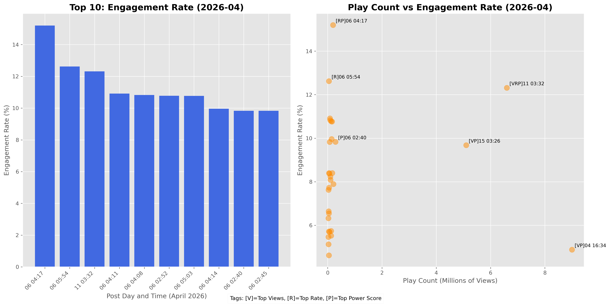

# NBA TikTok Data Pipeline & Analysis

TikTokの公開データから最新の投稿を自動収集し、エンゲージメントを可視化するツールです。
初期のプロトタイプから、実運用を見据えたアーキテクチャへの進化を継続しています。

## 🚀 Tech & Architecture
- **Language**: Python 3.x
- **Infrastructure**: AWS Lambda, Amazon S3
- **Data Engineering**: Apify API, Pandas, Matplotlib, Seaborn
- **Development**: python-dotenv (Security), GitHub Actions (Plan)

## 📊 Core Logic: VRP Labeling & Total ER
独自の多角的な指標により、単なる再生数（Views）に依存しないコンテンツの「質」を評価します。

### 1. VRP Labeling
- **[V] Views**: 拡散力（再生数 上位10%）
- **[R] Rate**: 熱狂度（エンゲージメント率 上位10%）
- **[P] Power**: 影響力（再生数 × 影響率 上位15%）

### 2. Strategic Engagement (Total ER) 【May 2026 Update】
「いいね」に加えて、TikTokアルゴリズムで重要視される**「保存数」「シェア数」**を統合した『Total ER（総合エンゲージメント率）』を算出。視聴者のより深い反応を可視化します。

## 📈 Analysis Results (Evolution)

### Phase 1: Basic Performance (April 2026)


### Phase 2: Strategic Audit (May 2026)
日本時間（JST）への時差変換とヒートマップ分析を導入。投稿時間帯と熱量の相関を特定しました。


## 🛡️ Security & Data
- **Confidentiality**: APIトークン等の機密情報は `.env` および Lambda環境変数で隠蔽。
- **Data Integrity**: 大容量の生データ（CSV）は `.gitignore` によりリポジトリから除外。

## ⚙️ Quick Start (Local Batch)
```bash
# 1. 依存ライブラリのインストール
pip install pandas python-dotenv apify-client matplotlib seaborn japanize-matplotlib

# 2. .env ファイルの作成
echo "APIFY_TOKEN=your_token_here" > .env

# 3. 分析バッチの実行
python src/analysis/nba_analysis.py